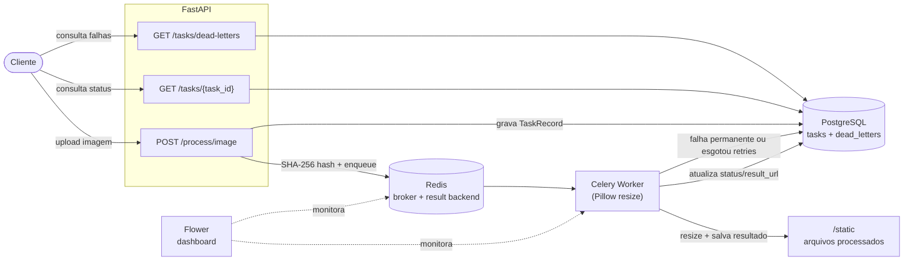

# AsyncTask Hub

API assíncrona de processamento de imagens, construída para demonstrar padrões de infraestrutura e engenharia de backend em produção: fila de tarefas distribuída, idempotência, Dead Letter Queue, graceful shutdown e testes automatizados.

Upload de uma imagem → processamento assíncrono via Celery → resultado persistido e servido por HTTP, com rastreamento de status em tempo real.

## Stack

| Camada | Tecnologia |
|---|---|
| API | FastAPI + Uvicorn |
| Fila de tarefas | Celery |
| Broker / Cache | Redis |
| Persistência | PostgreSQL + SQLAlchemy |
| Processamento de imagem | Pillow |
| Monitoramento de tasks | Flower |
| Rate limiting | slowapi |
| Testes | Pytest |
| Orquestração | Docker Compose |

## Arquitetura



## Funcionalidades

- **Processamento assíncrono de imagens** — upload retorna imediatamente com um `task_id`; o resize acontece em background via Celery, sem bloquear a API.
- **Idempotência por conteúdo** — cada upload tem o SHA-256 do arquivo calculado. Um arquivo já processado anteriormente não é reenfileirado: a API reaproveita o resultado existente instantaneamente.
- **Dead Letter Queue (DLQ)** — falhas são classificadas em permanentes (imagem corrompida, arquivo ausente) ou transitórias. Falhas permanentes vão direto pra DLQ; falhas transitórias são reprocessadas até 3 vezes antes de cair na DLQ. Cada falha é registrada no Postgres e numa fila dedicada do Redis.
- **Graceful shutdown** — o worker Celery trata `SIGTERM` como *warm shutdown*: para de aceitar tarefas novas e aguarda a tarefa em andamento terminar antes de encerrar. Combinado com `task_acks_late`, nenhuma tarefa é perdida se o worker for reiniciado no meio do processamento — ela volta pra fila automaticamente.
- **Rate limiting** — limite de requisições por IP no endpoint de upload, via `slowapi`.
- **Testes automatizados** — suíte com Pytest cobrindo upload, idempotência, status de tarefas, DLQ e os dois caminhos de falha (permanente e transitória).

## Como rodar

Pré-requisitos: Docker e Docker Compose.

```bash
cd docker
docker compose up -d --build
```

Isso sobe 5 serviços: PostgreSQL, Redis, API (porta `8000`), Celery worker e Flower (porta `5555`).

### Endpoints

**Processar uma imagem**
```bash
curl -X POST http://localhost:8000/process/image \
  -F "file=@caminho/para/imagem.jpg"
```
```json
{"task_id": "b9d1f6e1-12f0-41fe-b4cc-44b721eedb98", "status": "pending"}
```

**Consultar status de uma tarefa**
```bash
curl http://localhost:8000/tasks/{task_id}
```
```json
{
  "task_id": "b9d1f6e1-12f0-41fe-b4cc-44b721eedb98",
  "status": "completed",
  "result_url": "/static/processed/b9d1f6e1-12f0-41fe-b4cc-44b721eedb98.jpg",
  "error_message": null,
  "created_at": "2026-06-21T20:50:21Z"
}
```

**Listar falhas na Dead Letter Queue**
```bash
curl http://localhost:8000/tasks/dead-letters
```

**Monitorar tasks em tempo real**

Acesse [http://localhost:5555](http://localhost:5555) para o dashboard do Flower.

### Rodando os testes

```bash
pip install -r requirements.txt
pytest -v
```

A suíte usa SQLite em memória e mocka o Celery, então roda fora do Docker sem depender de Postgres ou Redis reais.

## Estrutura do projeto

```
app/
├── api/        # rotas FastAPI
├── core/       # config, database, rate limiter
├── workers/    # Celery app e tasks
├── schemas/    # modelos Pydantic (request/response)
├── models.py   # modelos SQLAlchemy (TaskRecord, DeadLetter)
└── main.py     # entrypoint da API
docker/         # Dockerfile e docker-compose.yml
tests/          # suíte Pytest
```
